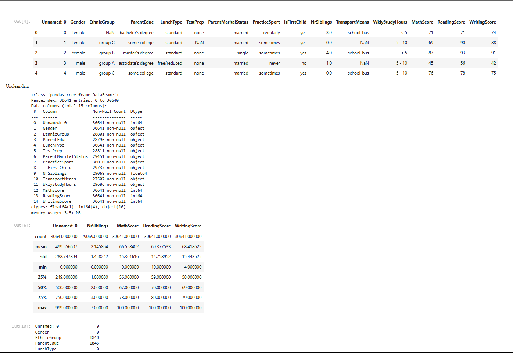
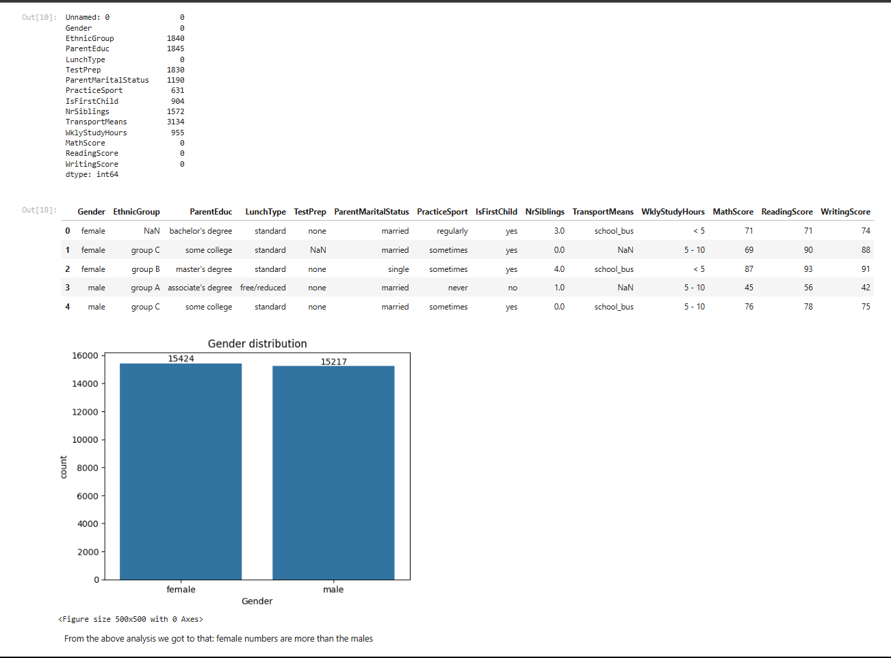
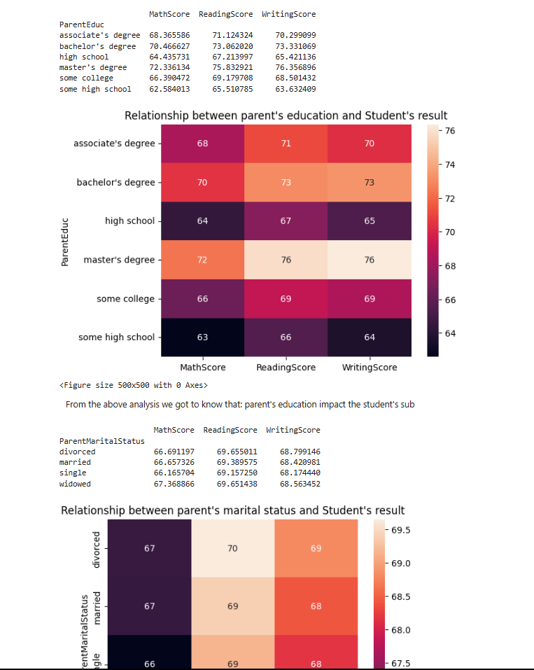
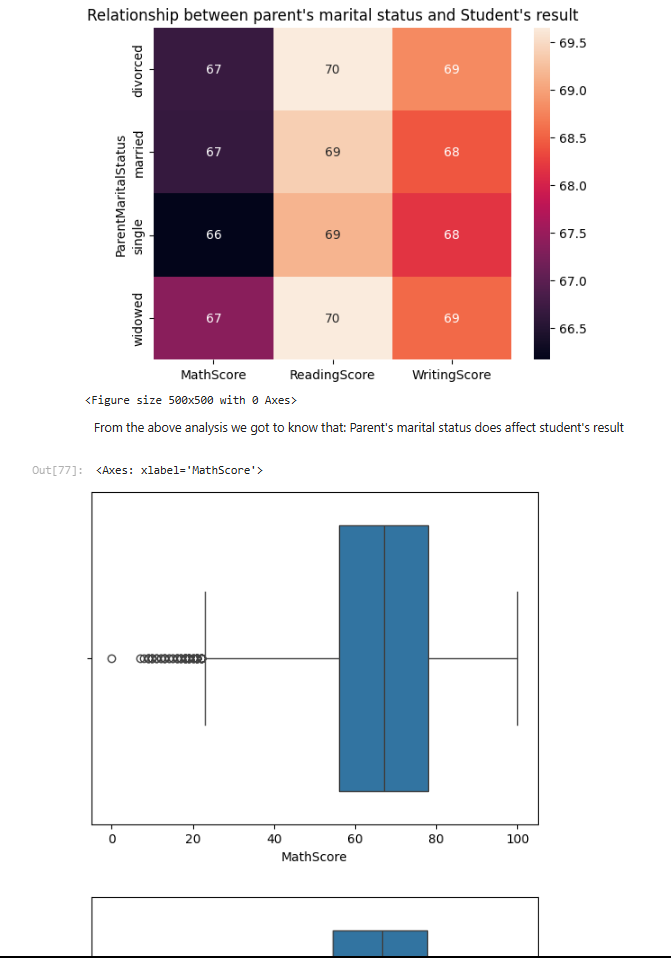
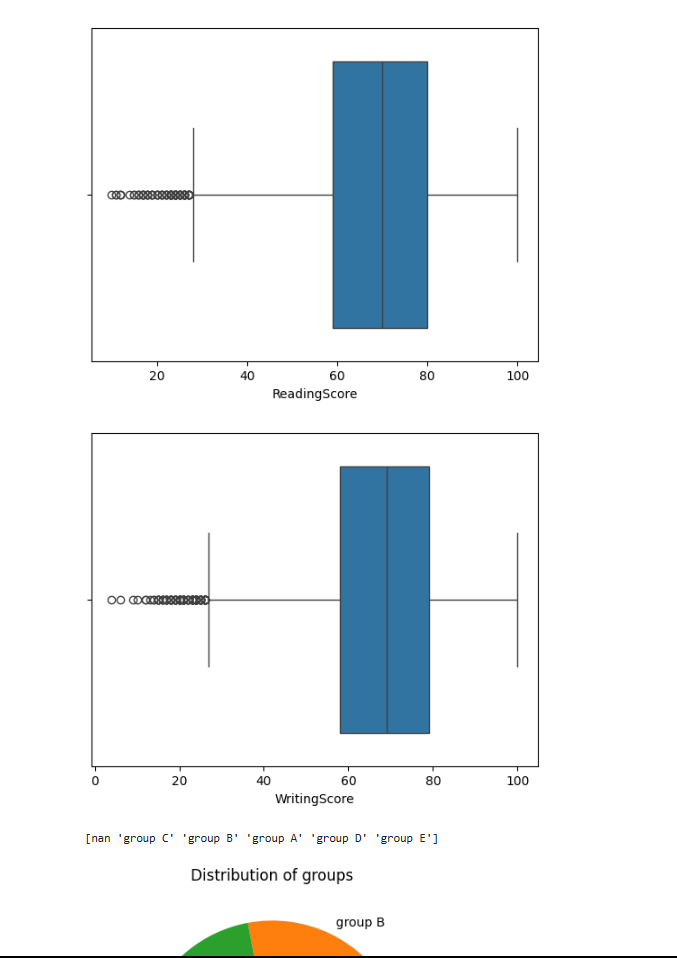
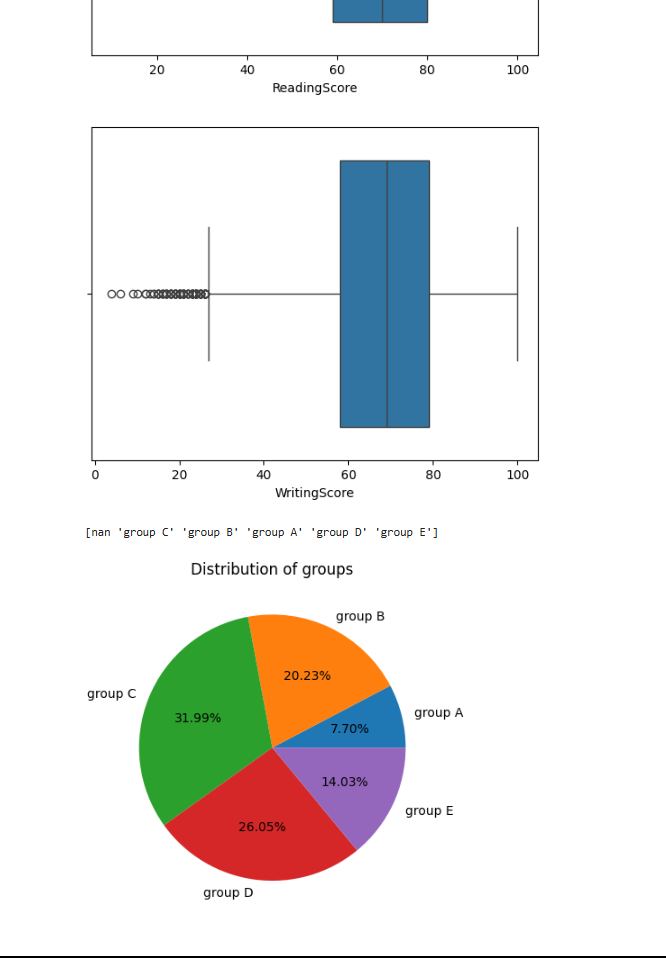

# 📚 Student's Exam Performance Analysis

A beginner-friendly data analytics project focused on analyzing student's academic performance using Python, Pandas, Matplotlib, and Seaborn. This project visualizes subject-wise scores, overall trends, and key insights using engaging charts and summaries.

---

## 📌 Project Overview

This project uses a dataset of students' exam results across multiple subjects to generate meaningful insights. The goal is to visualize patterns in academic performance, identify high and low performers, and support data-driven evaluation.

---

## 🧠 Key Features

- Subject-wise score analysis
- Summary statistics: average, max, min, standard deviation
- Visual insights through bar plots and pie charts
- Clean and modular code using Jupyter Notebook
- Interactive HTML preview of the entire notebook

---

## 🛠️ Tools & Technologies

- **Python**
- **Pandas** – for data manipulation
- **Matplotlib** – for basic data visualization
- **Seaborn** – for advanced and aesthetically pleasing plots
- **Jupyter Notebook**

---

## 📈 HTML Visualization Preview

📂 [Download and open the notebook preview](Preview/HTML.html) to see the full analysis with all visualizations.

---

## 📊 Dataset

- Format: CSV (embedded in the notebook)
- Contains student names and scores in subjects like Math, Science, and English

---

## 🚀 Getting Started

1. Clone the repository:
   ```bash
   git clone https://github.com/ChInMoY369/Student-s-exam-analysis.git
   ```

2. Navigate into the folder:
   ```bash
   cd Student-s-exam-analysis
   ```

3. Launch the notebook:
   ```bash
   jupyter notebook "Student Exam Result.ipynb"
   ```

---

## 🖼️ Preview

<p align="center">
  
  
  
  
  
  
</p>
